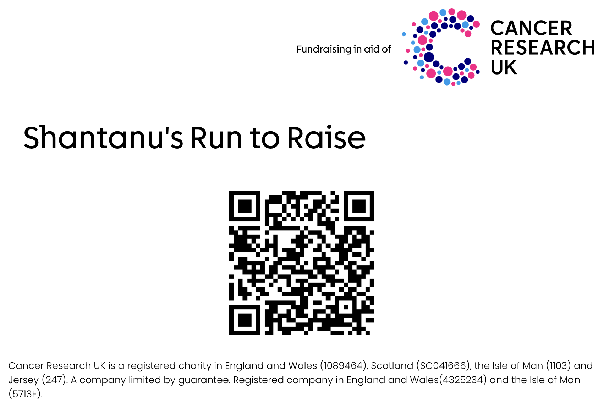

# Fundraising

Cancer has touched the lives of many people I love. Like many of you, I've watched loved ones face this disease with incredible courage, and I've seen firsthand the difference that research and support can make. That's why I'm raising money for **[Cancer Research UK](https://www.cancerresearchuk.org/)**, specifically for [brain cancer research](https://www.cancerresearchuk.org/our-research/our-research-by-cancer-type/our-research-into-brain-and-nerve-cell-tumours).

Globally, approximately 322,000 people are diagnosed with brain and central nervous system cancers each year; that's nearly 900 people every single day. Every pound donated helps fund groundbreaking research into better ways to prevent, detect and treat brain cancer, supports patients and their families, and brings us closer to a world where this devastating disease can be beaten. This cause is deeply personal to me, and I'm grateful for any support you can offer.

---

## Upcoming Events

### [Cambridge Half Marathon](https://cambridgehalfmarathon.com)
**8th March 2026**

I'm taking on my first ever half marathon this year! Running 13.1 miles is no small feat, especially for someone who's more accustomed to short runs than long-distance endurance. I'm currently on a rigorous 10-week training plan, logging miles in the cold and rain of Cambridge, and pushing myself further than I thought possible.

The TTP Cambridge Half Marathon takes place through the historic streets of Cambridge, passing through University college grounds and out to the beautiful village of Grantchester. Every training run is a reminder of why I'm doing this, for everyone affected by cancer and for a future where this disease can be prevented, treated, and ultimately cured.

### [Brighton and Hove 10k](https://www.londonmarathonevents.co.uk/brighton-marathon-weekend/brighton-hove-10k)
**12th April 2026**

After recovering from the half marathon, I'm stepping up to the Brighton 10k in April. This race is special for me, I'll be attempting to break the sub-1 hour barrier, trying to beat my current personal best of 1:09:21. It's an ambitious goal, but with weeks of training under my belt, I'm determined to push my limits for this cause.

The Brighton 10k offers a fast, flat course along the stunning Brighton seafront, making it perfect for a PB attempt. Every second I shave off my time represents the dedication to this cause that means so much to me.

---

## How to Donate

Use the below button or the QR code at the bottom of this page to donate:

<a href="https://fundraise.cancerresearchuk.org/page/8hantanu"><button>Donate to "Shantanu's Run to Raise"</button></a>

 
Every contribution, no matter the size, makes a real difference.

Thank you for being part of this journey with me. Let's make every mile run and donation count for something truly meaningful.

Best,
Shantanu.

