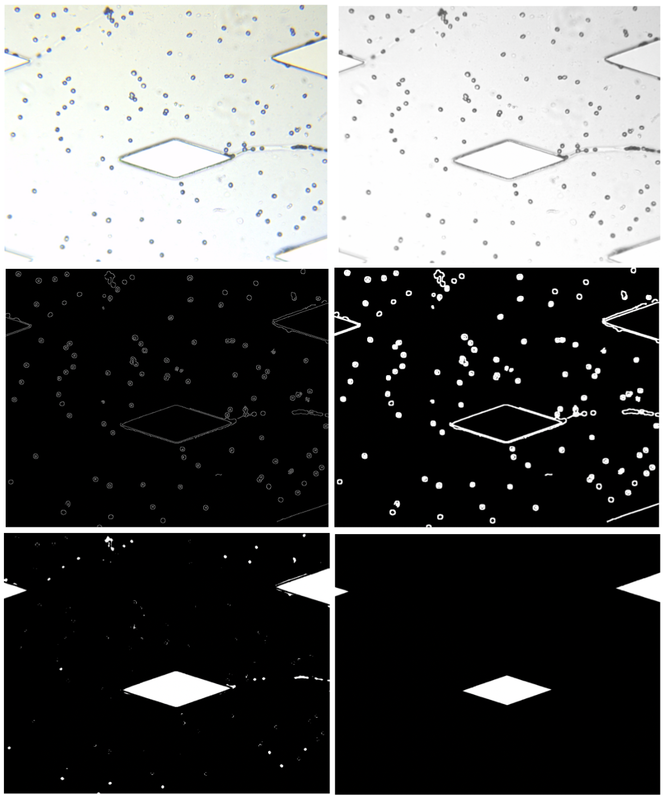
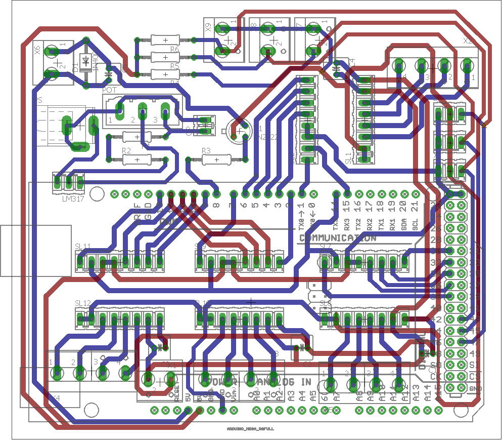

# Cytocube

TODO: Add project description

---

## Developer Logs for CytoCube

Below is the dev log while I was working on this project.

**NOTE:**  
- Any new task or improvement required can be added to the TODO list at the end of this document.  
- Code commits related to the daily logs can be found in the repo. The repos are private. For access, email your GitHub username.

#### Cytocube

**Task:** Develop C++ code for Cytocube based on the existing MATLAB code  
**Tools:** C++, Qt (GUI), OpenCV (Image processing), XiAPI (Image Acquisition)  
**Repo:** [GitHub - Cytocube](https://github.com/8hantanu/cytocube)

#### Cytodata

**Task:** Use deep learning to identify and count the number of blood cells from images acquired from Cytocube  
**Tools:** Python, Keras (Faster R-CNN), TensorFlow (backend), OpenCV (Image Processing)  
**Repo:** [GitHub - Cytodata](https://github.com/8hantanu/cytodata)  

### 16/05 - 18/05
- Got familiar with the MATLAB and Arduino code of Cytocube  
- Set up the dev environment in Windows (installed MinGW for C++ support) and Ubuntu (installed MATLAB).  

### 20/05
- Unlike MATLAB, there is no video handler for cam input available for C++. Went through the XiAPI to enable integration of the Ximea camera.  
- Created basic Qt GUI frame and started work on the Xicam video handler.  

### 21/05
- Created the video handler for the Ximea cam. The Xicam handler creates a new thread that runs in parallel and outputs the input stream as QImage in the GUI.  
- Currently, the QImage is rendered as a grayscale image.  
- Capable of acquiring images at 30 FPS.  

### 22/05
- Tested the serial communication between Arduino and the computer.  
- Serial read is problematic when there is no input from Arduino. The program waits until the next byte is received. If no byte is sent from Arduino, the program hangs.  
- Fix: Update Arduino code to send a byte every time or reset the serial file. No issue observed when connection was closed and reopened. Implemented in `comm::syncFile()`.  
- Created the comm handler for serial communication.  

### 23/05  
- Created the GUI.  
- Added slide navigation and reset buttons to GUI.  
- XiAPI supports only 30 and 60 FPS. If any other FPS value is requested, XiAPI sets the FPS to default (30).  


### 24/05  
- Improved the GUI and added goto, goHome, setHome buttons.  
- GUI gets stuck whenever there is some processing in the main thread.  


### 25/05  
- Using OpenCV built-in standard deviation function instead of variance for finding the best focus.  
- Created `autofocus(int travel, int steps)` method for crude and fine focus.  
- Using `QCoreApplication::processEvents()` to keep the Qt GUI updated and prevent hanging.  

**Note:** The image displayed in GUI (QImage) is rendered as grayscale, but every other operation/processing is done using the RGB24 XI_IMG format. Need a way to convert XI_IMG RGB24 format to QImage RGB.  

### 26/05  
- Initialized work on PFScan.  
- Fixed QImage, now supports RGB888 format. GUI supports color images.\
  Grayscale images were rendered due to the line
  ```
  memcpy(frame->data, image.bp, IMAGE_WIDTH*IMAGE_HEIGHT);
  ```
  which was changed to
  ```
  memcpy(frame->data, image.bp, 3*IMAGE_WIDTH*IMAGE_HEIGHT);
  ```
  to copy input from all three channels(RGB).

### 27/05  
- Implemented PFScan. Images captured at 10 frames per second. AutoFocus takes ~5s (full FoV) compared to 14s in MATLAB (selected RoI).  
- Initialized work on AreaScan.  

### 28/05  
- Fixed AutoFocus hanging issue. Previously, a ping signal was sent before any movement signal, causing timeout issues (in host computer). Ping removed during AutoFocus.  
- Implemented AreaScan.


### 29/05  
- Moved PFScan option to AreaScan when tile size is set to X.  
- Created demo video.

### 30/05  
- Implemented and tested different focus methods:  
  - Variance / Standard Deviation  
  - Brenner’s Gradient  
  - Sobel Operator’s Magnitude Sum  
  - Laplace Operator’s Variance  
- **SobelSum** gives the best focus but takes twice the time of **variance**.  
- Minor GUI tweaks.  

### 31/05  
- Tested various time delays for moving across a single FoV.  
  - **75ms**: Captures 10 images/sec, but ~2 images are blurry.  
  - **100ms**: Captures 7-8 images/sec, images are clear.  
  - **150ms**: Captures 6 images/sec.  
  - Can be set in `MOVEMENT_DELAY` in `comm.h`.  
- Fixed RGB channel encoding for QImage, image now displayed as captured. 
- Final GUI tweaks.


### 01/06  
- Looking into selection of RoI without pillars in CBC slide.  
- Approach used:  
  1. Acquire the image  
  2. Convert to grayscale  
  3. Detect edges  
  4. Dilate edges to close gaps  
  5. Fill holes to get pillar areas  
  6. Erode smaller blobs to remove cell clusters  



### 03/06  
- Enhanced and implemented RoI selection.  
- Added test options and focus options.  
- Initialized work on RBC detection and count.

### 04/06  
- Researched image processing and machine learning methods for identification and counting of bloods.  
- Faster R-CNN (Region-Based Convolutional Neural Network) found to be best suited.  

### 06/06  
- Using Python instead of C++ due to lack of deep learning library support.  
- Using [keras-frcnn](https://github.com/kbardool/keras-frcnn) for model training.  
- Wrote scripts for data preprocessing.  
- Testing on a Kaggle dataset of [blood cells](https://www.kaggle.com/datasets/paultimothymooney/blood-cells).  

### 07/06
- Implemented focal stack in Cytocube.  
- Job script for SLURM.

### 08/06
- Fixed time delays
- Reorganized code into modules.  
- Put the job script to queue (epochs - 1000, maxtimealloc - 24hrs)

### 10/06
- Add image concat in focal stack
- Model testing: some RBCs not identified, need more epochs.
- Code cleanup

### 11/06
- Ran focal stack for 1000 images
- Added comments to xicam and serial comm modules

### 12/06
- Added option for manual whitebalance
- Finished adding comments in cyto modules
- Some code refactoring

### 13/06
- Converted C++ preprocessing code to Python.  
- Added shape detection for OFM slides.
- Added get direction vector function from a given shape

### 14/06
Added movement corresponding to direction
Added find RoI for OFM
Enabled binning for OFM slides


### 15/06
GUI Tweaks
Added tabbed view in GUI

### 17/06
- Arduino code for syringe pump  
- Calculation for distance traveled  

$$ \text{spt} = 1.23 \times 10^{-4} \text{ mm} $$

$$ t \propto \text{mov_delay_coeff} $$

$$ t = k \cdot \text{mov_delay_coeff} \times 10^{-3} $$

Where:  
- $$ s $$ is the distance traveled in a single pulse of the stepper motor  
- $$ t $$ is the time taken to travel $$ s $$  
- $$ k $$ is the proportionality coefficient  
- $$ \text{mlps} $$ is microliters per second  
- $$ \text{spt} $$ is the distance traveled in a single pulse  
- $$ r $$ is the syringe radius  

Velocity of the pumper:

$$ v = \frac{\text{mlps} \ (\text{mm}^3/s)}{\pi r^2 \ (\text{mm}^2)} $$

$$ v = \frac{\text{spt}}{t} = \frac{\text{spt}}{\text{mov_delay_coeff} \times 10^{-3}} $$

Rearranging for $$ \text{mov_delay_coeff} $$:

$$ \frac{\text{mlps}}{\pi r^2} = \frac{\text{spt}}{\text{mov_delay_coeff} \times 10^{3}} $$

$$ \text{mov_delay_coeff} = \frac{\text{spt} \cdot \pi r^2 \times 10^3}{\text{mlps}} $$

In our case:

$$ \text{spt} = 1.23 \times 10^{-4} \text{ mm} $$

$$ \text{mlps} = 100 \text{ ul/s} $$

$$ d = 9 \text{ mm} \quad \Rightarrow \quad r = 4.5 \text{ mm} $$

$$ a = 63.61 \text{ mm}^2 \text{ (area of the needle)} $$

$$ k \approx 1 $$

Velocity of the pumper:

$$ v = \frac{\text{mlps} \ (\text{mm}^3/s)}{63.61 \ (\text{mm}^2)} $$

$$ v = 1.572 \times 10^{-2} \times \text{mlps} \text{ mm/s} $$

### 18/06  
- Arduino code for syringe pump  
- Integrated syringe pump with GUI  

### 19/06  
- Added option for capturing image stream  
- Arduino code for sample agitator  
- Integrated agitator with GUI  

### 20/06  
- Automated vial agitator while pumping  
- Testing of OFM device using Cytocube  

### 21/06  
- Updated Arduino code for Cytocube to run motors simultaneously  
- Made use of motor driver’s enable pin  
- Updated PCB for the same  

### 24/06  
- Added agitator and pump circuits to PCB  

### 25/06  
- Made changes in PCB  
- Refactored code  

### 26/06  
- Completed PCB design  



### FIXME  
- ~~Render QImage in RGB888 format from the XI_IMG RGB24~~  
- Find another way for syncing serial comm instead of resetting the serial comm link  
- ~~Unexpected hanging during autofocus _(possible cause: next signal sent before previous signal is executed)_~~  
- ~~Fix channel color RGB/BGR for rendering in QImage~~  
- Requires MATLAB to be opened after reboot before running C++ program  
- Optimize image save and capture  
- Fix crash when switching from binning to full FoV  

### TODO  

#### Cytocube  
- ~~Create Ximea camera image handler~~  
- ~~Enable serial communication through C++~~  
- ~~Add basic navigation~~  
- ~~Add autofocus~~  
- ~~Add PFScan and Area Scan~~  
- ~~Add logger (`QDebug` and on GUI)~~  
- ~~Add timers~~  
- ~~Pillar detection~~  
- ~~Focal stack with PF, FS-I, and FS-II~~  
- Add AF I, II, III in focal stack  
- ~~OFM navigation based on pillar directions~~  
- ~~Bringing OFM slide RoI in FoV~~  
- ~~Add buttons for OFM slide I and II~~  
- Disable some buttons until reset is pressed  
- Flip image in GUI  
- ~~Arduino code for syringe pump~~  
- ~~Integrate syringe pump with GUI~~  
- ~~Automate vial agitation~~  
- ~~Optimize motor movements _(code and hardware)_~~  

#### Cytodata  
- ~~Generate image data for creating training model~~  
- ~~Data labeling~~  
- ~~Identification of RBCs and WBCs~~  
- Counting of RBCs and WBCs  
