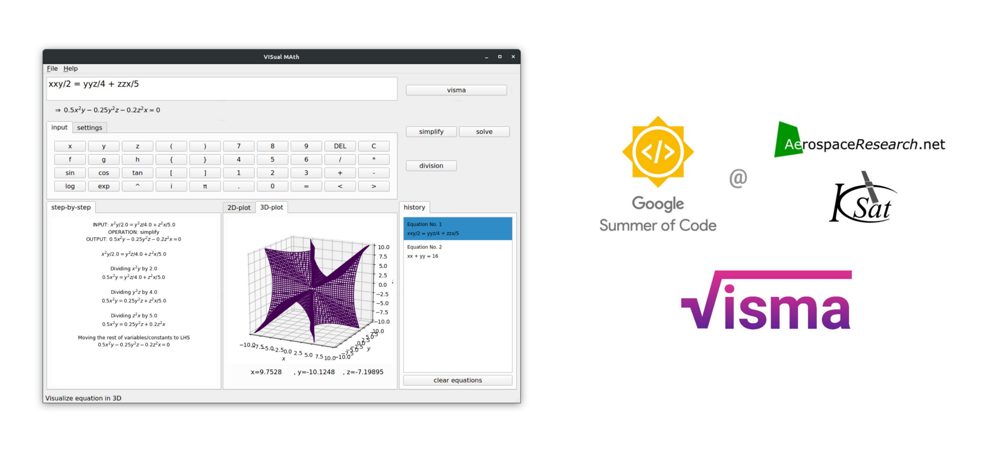
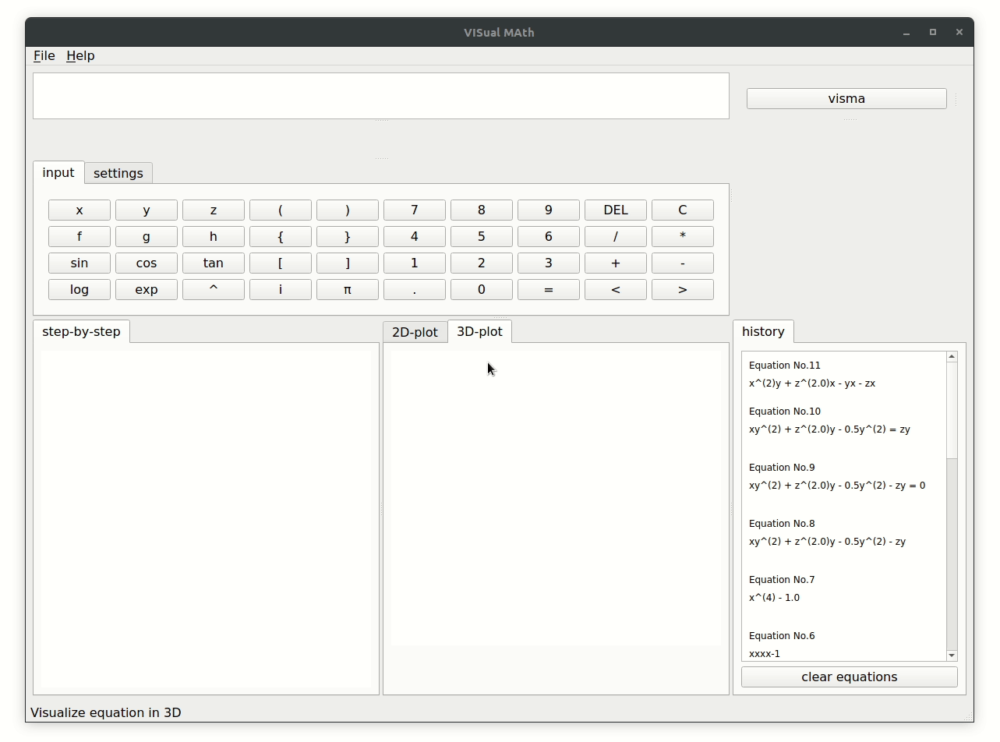

# visma
**visma - VISualMAth**, an equation solver and visualizer, which aims at showing the step-by-step solution and interactive plots of a given equation.



## deliverables

The major changes which were proposed for the project **visma** during GSoC'18:

- changing the codebase to follow object-oriented style
- calculus operations like integration, differentiation (including partial diff.)
- solving equations/inequalities and multivariable linear equations
- improved GUI and interactive plots

The following file structure shows which modules were added/modified to the [project](https://github.com/aerospaceresearch/visma) during the GSoC period:

```
visma
 │
 ├─ visma (contains all modules)
 │   │
 │   ├─ calculus (added basic differentiation and integration)
 │   ├─ functions (converted from dictionary to class based tokens for functions)
 │   ├─ gui (added elements like qsolver, plotter, settings and modified steps displayer)
 │   ├─ io (reorganized tokenize and added checks and parser for equations)
 │   ├─ matrix (added matrix operation, to be integrated with GUI)
 │   ├─ simplify (reorganized simplify into addsub and muldiv)
 │   ├─ solvers (added solver for multivariable equation)
 │   └─ transform (added modules like factorization and substitution)
 │
 ├─ tests (unit tests for all the above modules using pytest)
 │   │
 │   ├─ test_calculus.py (constains test cases for calculus)
 :   :..
 :
 ├─ main.py (modified to accomodate all new GUI elements)
 ├─ run.sh (modified to support installing, testing and packaging visma)
 └─ setup.py (for packaging visma)
```

Below is a real quick demo of some of the features like calculus, solver, plotter etc which were implemented in visma. To experience **visma** and explore all features, go to the [install guide](https://github.com/aerospaceresearch/visma/blob/master/README.md#installation) or [code wiki](https://github.com/aerospaceresearch/visma/wiki).



There were many new things I came across while working on this project. I learned about integrating UI elements (using **_PyQt_**), unit-testing (using **_pytest_**) and packaging python apps (using **_PyPI_**). To get a deep insight into my progress and learnings throughout the completion of the project check out the GSoC devlogs -

- **Week 01-02: [Making ViSMA 'classy'](log-01)** - Changed code to follow object-oriented style
- **Week 03-05: [Integrating the Integrator](log-02)** - Added the calculus modules
- **Week 06-07: [Finding the Unknown](log-03)** - Implemented solvers
- **Week 08-09: [Develop, Test, Repeat](log-04)** - Added unit testing for all modules
- **Week 10-11: [Dynamic Simplification and Plotting](log-05)** - Enhanced the GUI
- **Week 12-13: [Packing Up](log-06)** - Finishing touches, packaging code, documentation

## future work

Though the GSoC'18 period has ended there are a lot of new things which can be added to **visma**. Some of the changes and features I intend to (others can too) add in **visma** after GSoC are:

- Add command line interface for visma
- Add support for more functions
- Fix the [issues](https://github.com/aerospaceresearch/visma/issues) created
- Make a webapp

## links

- **Project Source** - [https://github.com/aerospaceresearch/visma](https://github.com/aerospaceresearch/visma)
- **My Commits** - [https://github.com/aerospaceresearch/visma/commits?author=8hantanu](https://github.com/aerospaceresearch/visma/commits?author=8hantanu)
- **Final PR** - [https://github.com/aerospaceresearch/visma/pull/61](https://github.com/aerospaceresearch/visma/pull/61)
- **Documentation** - [https://github.com/aerospaceresearch/visma/wiki](https://github.com/aerospaceresearch/visma/wiki)
- **TODO board** - [https://github.com/aerospaceresearch/visma/projects/1](https://github.com/aerospaceresearch/visma/projects/1)
- **Alternate link** - [https://aerospaceresearch.net/?p=997](https://aerospaceresearch.net/?p=997)

