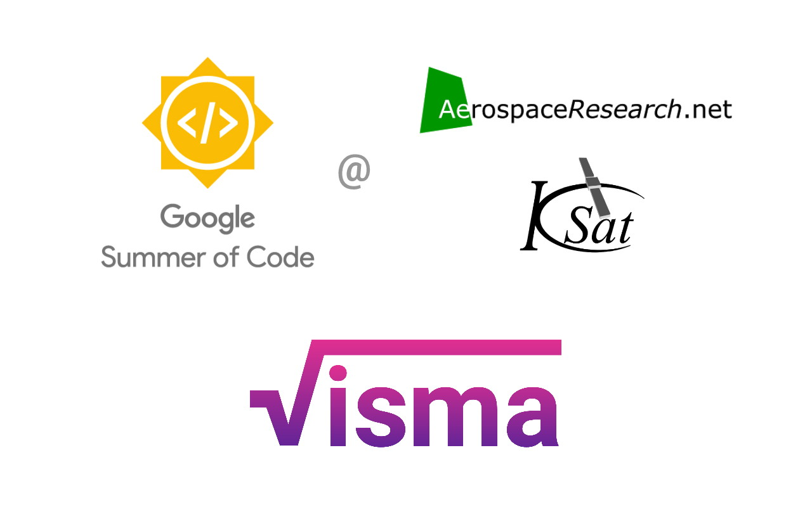

# log 02 - integrating the integrator

This is GSoC log 02 (view [previous log](log-01)). Here I will cover on what I have done in week 03-05 and a gist of what has been accomplished in Phase I coding period.

## done so far

- Created parser.py which handles conversion of tokens to LaTeX or strings and vice-versa.
- Some simplification issues were fixed
- Integrated the differentiation.py and integration.py to the project along with the step-by-step explanation.
- Support for partial differentiation and "partial integration" was added.
- The code was again refactored to decrease complexity and remove unused modules.
- Added factorize.py module. Can currently factorize polynomials.

The differentiation.py works for all functions. The integration.py is a tough one. There are going to be many checks for integration as when to apply by-parts or some another method. I am working on a simpler version of integration by-parts algorithm. For now, VisMa supports basic calculus operations. Also, transform module was added to change from one function type to another.

The below demo shows the newly added functionalities like factorizing polynomials, differentiating and integrating expressions with respect to a variable.

## phase - 1 deliverables

- **Modules created**:
  - **Functions** - All function classes added
  - **GUI/Plotter** - Graph plotting added
  - **IO** - Input, output parsers
  - **Calculus** - Diff and integrate
- **Issues fixed**:
  - Refactored code to follow object class style
  - Rectified equation/expression simplifications
  - Embedded solver into main GUI
  - Reorganized code into smaller modules

## what i will be doing next

The next thing which I will work on is a basic equation solver. For making the equation solver modules like factorization, expression multiplication and division are required.

Also as the number of functions are increasing, the cases to test are increasing. I will try to automate testing using unit tests.

Most of the time of phase II period will be spent on working on all kinds of solvers. Also, calculus functionalities will be enhanced and support for more types of functions will be added.

Link to [project source](https://github.com/aerospaceresearch/visma "visma") and [to-do board](https://github.com/aerospaceresearch/visma/projects/1 "Project Progress"). Link to [next log](log-03).
